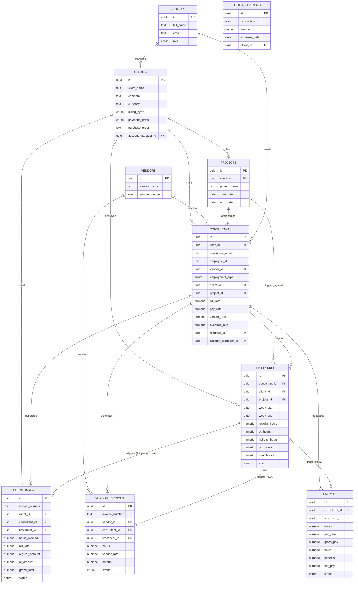

# ER Diagram — IT Staffing SaaS



## Automation flow (matches trigger `trg_timesheet_approved`)

```
Timesheet.status -> APPROVED
        │
        ▼
Create Client Invoice (always)
        │
        ├── employment_type = C2C ──► Create Vendor Invoice
        │
        └── employment_type = W2  ──► Create Payroll record
        │
        ▼
Notification row inserted (email worker picks it up)
        │
        ▼
Dashboard / P&L view (v_profit_loss) reflects new numbers automatically
  since it's computed live from client_invoices + vendor_invoices + payroll
```
